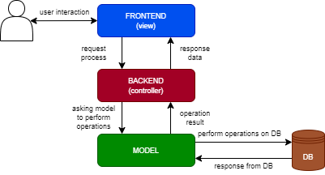

# Architectural Document

This project is done by Expriva Spa interns:

- Alejandro Acosta
- Alessandro Panzieri
- Lorenzo Palombi
- Matteo Carbone

We work together with Francesco Fornari, an offering and solutions architect in Exprivia.

Francesco assisted us in simulating a real work project, which consisted of an employees management system for a fake company called Gamma Security Services.

## What is Gamma Security Services?

GSS is a worldwide military private security company (PMSC). For each *on* or *off* duty employee, registered in the management system, it is possible to view a personal card that presents all the following data:

### as person

- generic information
- photography
- contacts

### as GSS employee

- Military rank
- current assignment (e.g. mission commander in xxx)
- current status (in service/resigned/fired/retired)
- chronology of service statuses, associated with a date

Only some users of the system have the possibility to create, modify or delete employee's data, while all others only have the possibility to consult them.

The system is usable via common web browsers, therefore end users haven't to install any software on their workstations. To ensure its maintainability, the system has been developed using cutting-edge technologies and the architecture has an approach open to new features.

## Software Requirements and Analysis

### Frontend

- #### **FE - 01**

  The user interface allows users to navigate employee's data.

- #### **FE - 02**

  The user interface allows to filter the user research by department, years of service, etc...

- #### **FE - 03**

  The user interface allows specific users to modify these employee's data.

### Backend

- #### **BE - 01**

  The system backend is based on REST-API, ensuring access to employee's data.

- #### **BE - 02**

  The system exposes an authentication mechanism based on JWT tokens to protect user information.

- #### **BE - 03**

  Communication between frontend and backend is secured by an SSL channel.

### Database

- #### **DB - 01**

  To store employees' data, a non-relational database is used, such as MongoDB.

- #### **DB - 02**

  Each document contains employee's data.

- #### **DB - 03**

  Each document has a unique id, to search or update each employee's data.

  

  This is the ER (entity-relation) model diagram. It represents the schema of the collections used in our DB, including the document. Every operational employee has at least one event assigned. Every event is assigned to one and only operational employee. Since administrators don't have any events assigned to their careers, the administrator employee's collection is free from links to other collections. Here we show some examples of collections stored in the DB:

  - #### **Empoyees collection**

    *"id"* : "007",\
    *"first_name"* : "Clarissa",\
    *"last_name"* : "Vicoli",\
    *"birthdate"* : "17/08/1983",\
    *"email"* : "<cvicoli@abc.com>",\
    *"phone"* : "366 717 8886",\
    *"current_status"* : "active"\
    *"rank"* : "captain",\
    *"assignment"* : "captain at Rome regiment"

  - #### **Administrators collection**

    *"id"* : "010",\
    *"first_name"* : "Giorgio",\
    *"last_name"* : "Manganello",\
    *"birthdate"* : "15/11/1999",\
    *"email"* : "<gmanganello@abc.com>",\
    *"phone"* : "345 765 8882",\
    *"current_status"* : "active"

  - #### **Events collection**

    *"id"* : "01",\
    *"date"* : "12/06/2013",\
    *"description"* : "command post n.1 at US military Airport in South Korea"\
    *"employee_id"* : "008"

## Architecture Diagram

This diagram wants to show the customer how our web app works.

Starting from the first interaction using the UI provided by the frontend, a request process is launched; once a request, the backend asks the model the operations to be performed on the database, which will return an operation result containing the data that will be then shown by the frontend directly to the user.

## Deployment

### Intro

By creating multiple virtual machines and setting up an SSH connection, we want to simulate remote access to the server machine that makes our service available. It was then decided to manage the virtual machines' frontend, backend and database services by containerizing them using Docker.

### Virtual Machine download and installation

Oracle's VirtualBox was chosen as the software to host the Virtual Machine. We wanted to simulate a Linux environment with the Debian operating system (12.5 version, 64-bit). It was installed with 2048 MB base memory, 4 processors and 20 GB of storage. The network has been set to a Bridged Adapter.

### Virtual Machine configuration and starting

After accessing the Virtual Machine for the first time, this one must be configured. Therefore, the time zone, language, location, keyboard and Host Name are set. The password for the root user is set and a non-root user is created and added to the sudoers list. Finally, SSHD (Secure Shell Host Daemon) is configured to allow users to connect via SSH connection.

### SSH Connection and PuTTY remote access

An SSH connection has been configured via the PuTTY program that allows to remotely access the Virtual Machine from the PC via the command prompt. In order to access it, you need the Host Name or IP address of the server machine and the number of the hardware port associated with SSH connections (default 22). After logging in as root we continue the actual configuration by installing Git, Vim and Docker.

### Docker installation and uses

By installing Docker, the frontend/backend components and the database were divided into containers. Web app containerization ensures that each component is isolated from the others in a virtual container. Thanks to this approach it is possible to provide the system with greater flexibility. Containers allow us to install our application in small, isolated and controlled environments without having to worry about installing the operating system. It is also possible to add or remove container instances for scalability reasons, without modifying the underlying infrastructures. Reproducing the same execution environments on multiple environments, simplifying the development, testing and operation of the service is also possible.

